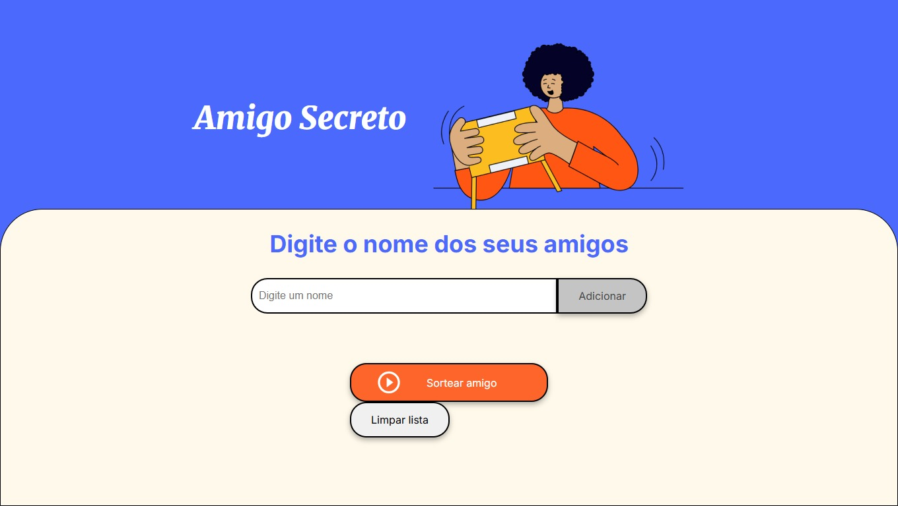
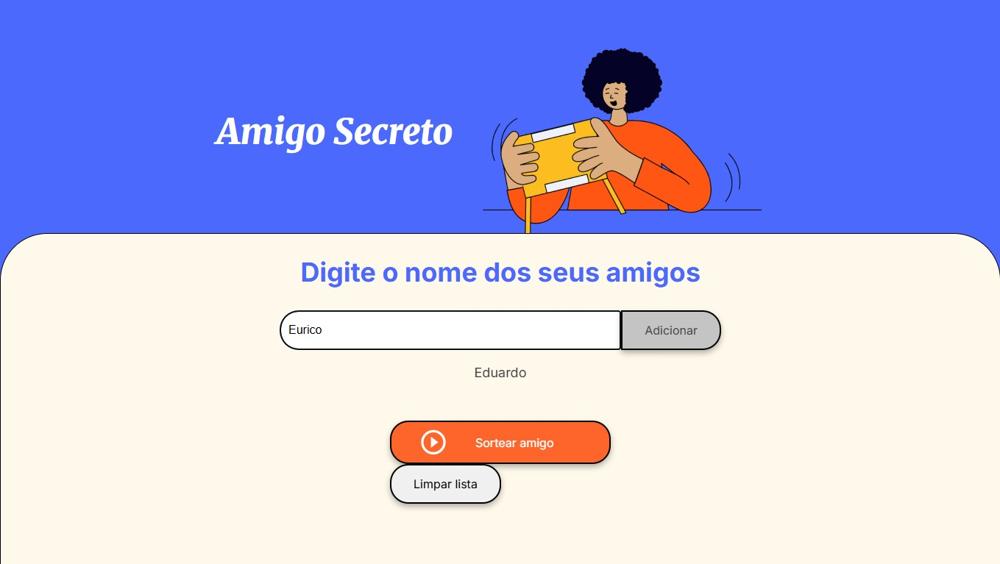
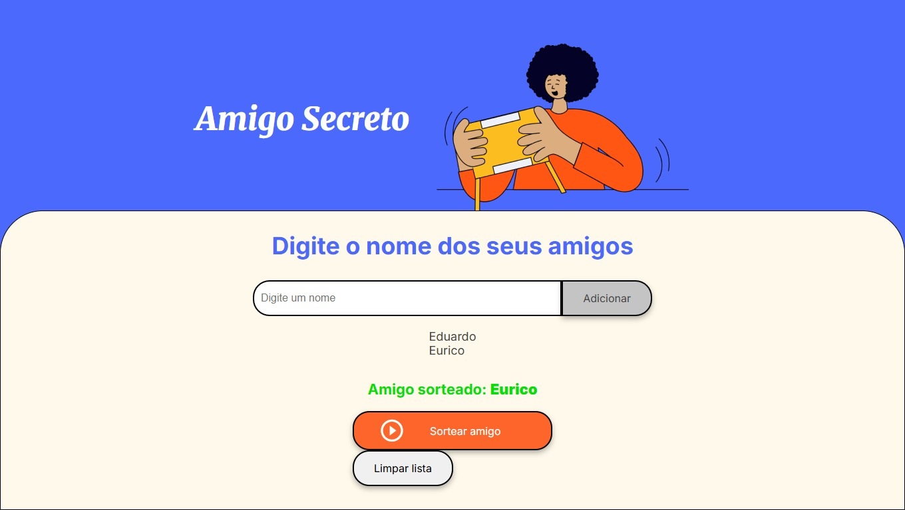

# Amigo Secreto

Uma aplicação web simples para organizar sorteios de amigo secreto entre amigos, familiares ou colegas.

---

## Tela Inicial

---

## Funcionalidades Detalhadas

| Funcionalidade           | Descrição                                                                 |
|--------------------------|---------------------------------------------------------------------------|
| ➕ Adicionar participantes | Permite inserir nomes de amigos em uma lista através de um campo de texto. |
| 📜 Exibir lista de amigos | Mostra todos os participantes adicionados dinamicamente em uma lista na tela. |
| 🔀 Sortear amigo secreto  | Realiza o sorteio aleatório de um nome entre os participantes cadastrados. |
| 🧹 Limpar lista           | Remove todos os nomes adicionados e o resultado do sorteio da interface. |

---

## Exemplos Visuais

### ➕ Adicionando amigos

---

### ✅ Resultado do sorteio

---

## Preview Online

Acesse a aplicação publicada no GitHub Pages:  
➡️ [https://eduardoeurico.github.io/Amigo-Secreto](https://eduardoeurico.github.io/Amigo-Secreto)

---
